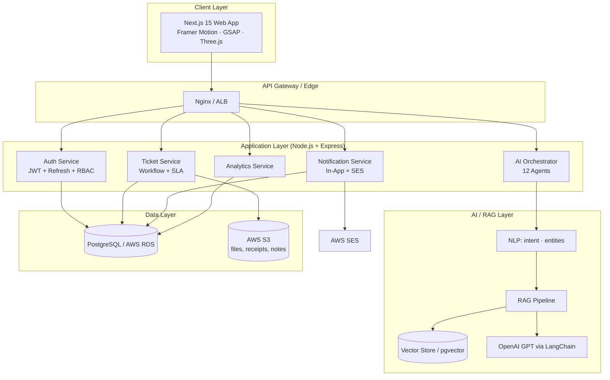
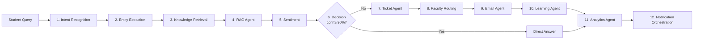
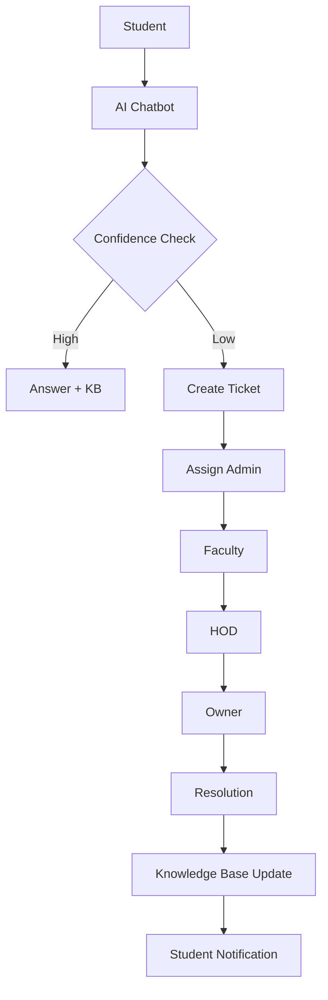
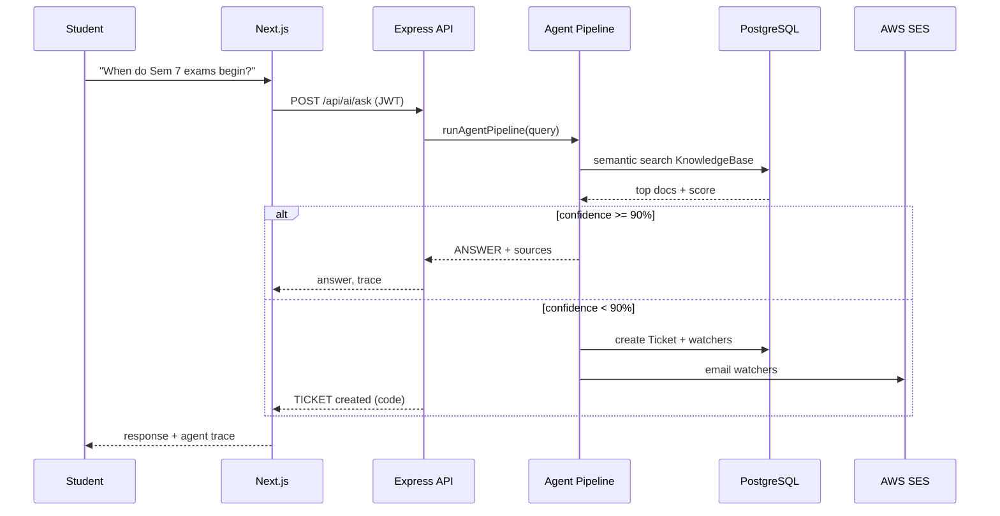
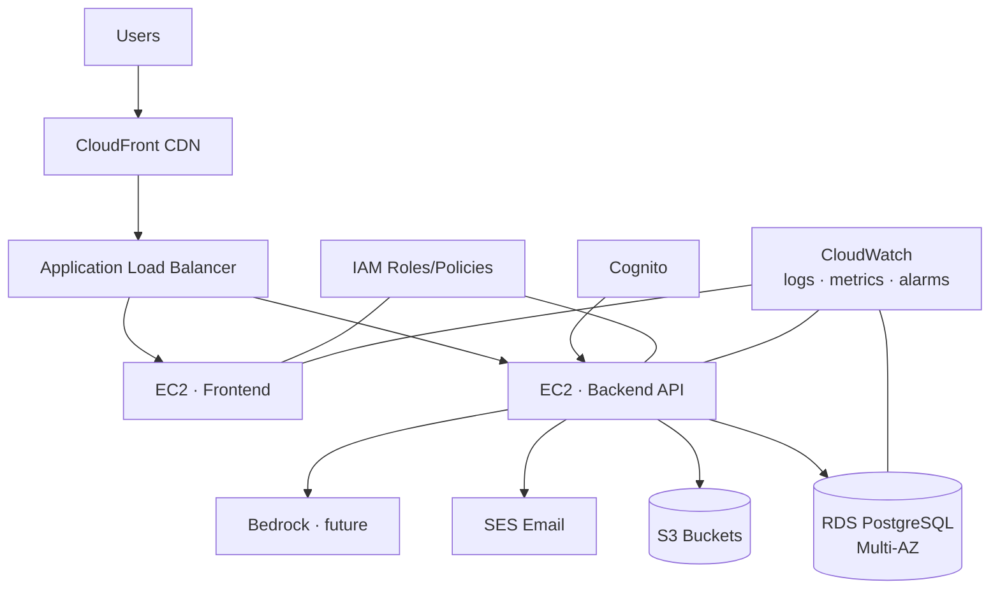

# System Architecture — SOU AI HelpDesk Pro

## 1. High-Level System Architecture

## 2. Multi-Agent Architecture

## 3. Ticket Workflow

## 4. Sequence Diagram — Ask AI / Auto-Ticket

## 5. AWS Production Architecture

## 6. RBAC Matrix (summary)

| Capability | Student | Admin | Faculty | HOD | Owner | Super Admin |
|---|:--:|:--:|:--:|:--:|:--:|:--:|
| Raise/track tickets | ✅ | ✅ | ✅ | ✅ | ✅ | ✅ |
| Assign tickets | | ✅ | | ✅ | | ✅ |
| Resolve/escalate | | ✅ | ✅ | ✅ | | ✅ |
| Mark attendance | | | ✅ | | | |
| Add/remove members | | | | ✅ | | ✅ |
| Revenue & forecasting | | | | | ✅ | ✅ |
| SLA sweep / global config | | | | | ✅ | ✅ |
