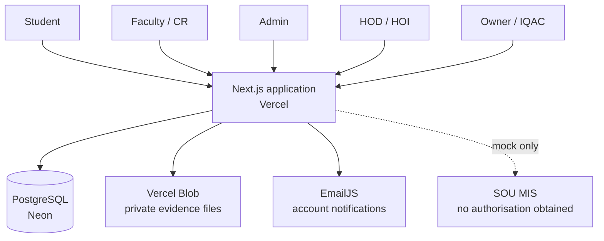
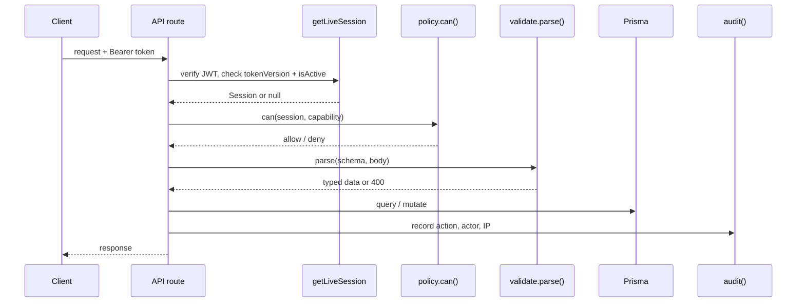
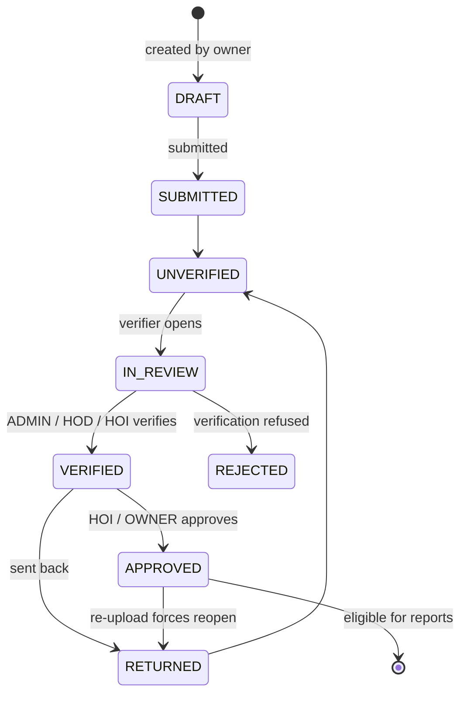
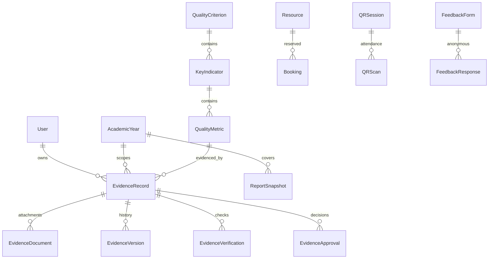
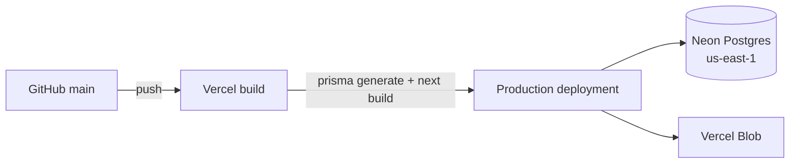

# Architecture - SOU AI HelpDesk Pro

## 1. System context

```mermaid
graph TB
    S[Student] --> APP
    F[Faculty / CR] --> APP
    A[Admin] --> APP
    H[HOD / HOI] --> APP
    O[Owner / IQAC] --> APP
    APP[Next.js application<br/>Vercel] --> DB[(PostgreSQL<br/>Neon)]
    APP --> BLOB[Vercel Blob<br/>private evidence files]
    APP --> MAIL[EmailJS<br/>account notifications]
    APP -.mock only.-> MIS[SOU MIS<br/>no authorisation obtained]
```

The SOU MIS link is deliberately mock. No credentials are requested from users
and no scraping occurs; the adapter refuses live mode unless an API key is
explicitly provisioned.

## 2. Application structure

```mermaid
graph LR
    subgraph Pages
        P1[Role dashboards]
        P2[/iqac Evidence vault/]
        P3[/bookings GreenReserve/]
        P4[/attendance/qr/]
        P5[/feedback /grievance/]
    end
    subgraph API["API routes (catch-all)"]
        R1[/api - core, auth, tickets/]
        R2[/api/gr - bookings/]
        R3[/api/qr - attendance/]
        R4[/api/inst - feedback, grievance/]
        R5[/api/iqac - evidence/]
        R6[/api/iqac-insight - dashboard, data quality/]
        R7[/api/iqac-report - report builder/]
        R8[/api/exam /api/insights /api/reports/]
    end
    subgraph Shared["Shared libraries"]
        L1[server-auth.ts<br/>JWT, bcrypt, lockout]
        L2[policy.ts<br/>capability matrix]
        L3[validate.ts<br/>zod schemas]
        L4[crypto.ts<br/>AES-256-GCM]
        L5[audit.ts<br/>redacting writer]
        L6[prisma.ts]
    end
    Pages --> API
    API --> Shared
    Shared --> DB[(PostgreSQL)]
```

Every API route is a catch-all (`[...path]`) re-exporting handlers from a
library module. This keeps the number of route files small and puts all logic
in testable modules rather than in route files.

## 3. Authenticated request flow

```mermaid
sequenceDiagram
    participant C as Client
    participant R as API route
    participant A as getLiveSession
    participant P as policy.can()
    participant V as validate.parse()
    participant D as Prisma
    participant L as audit()

    C->>R: request + Bearer token
    R->>A: verify JWT, check tokenVersion + isActive
    A-->>R: Session or null
    R->>P: can(session, capability)
    P-->>R: allow / deny
    R->>V: parse(schema, body)
    V-->>R: typed data or 400
    R->>D: query / mutate
    R->>L: record action, actor, IP
    R-->>C: response
```

Four gates before anything is written: authenticated, not revoked, permitted,
and well-formed. Audit happens after the write so a failed action is not
recorded as a successful one.

## 4. Evidence lifecycle

```mermaid
stateDiagram-v2
    [*] --> DRAFT: created by owner
    DRAFT --> SUBMITTED: submitted
    SUBMITTED --> UNVERIFIED
    UNVERIFIED --> IN_REVIEW: verifier opens
    IN_REVIEW --> VERIFIED: ADMIN / HOD / HOI verifies
    IN_REVIEW --> REJECTED: verification refused
    VERIFIED --> APPROVED: HOI / OWNER approves
    VERIFIED --> RETURNED: sent back
    APPROVED --> RETURNED: re-upload forces reopen
    RETURNED --> UNVERIFIED
    APPROVED --> [*]: eligible for reports
```

Two rules are enforced server-side and cannot be skipped from the UI:
approval requires prior verification, and the verifying role is not the
approving role.

## 5. Data model - principal entities

```mermaid
erDiagram
    User ||--o{ EvidenceRecord : owns
    AcademicYear ||--o{ EvidenceRecord : scopes
    QualityCriterion ||--o{ KeyIndicator : contains
    KeyIndicator ||--o{ QualityMetric : contains
    QualityMetric ||--o{ EvidenceRecord : evidenced_by
    EvidenceRecord ||--o{ EvidenceDocument : attachments
    EvidenceRecord ||--o{ EvidenceVersion : history
    EvidenceRecord ||--o{ EvidenceVerification : checks
    EvidenceRecord ||--o{ EvidenceApproval : decisions
    AcademicYear ||--o{ ReportSnapshot : covers
    Resource ||--o{ Booking : reserved
    QRSession ||--o{ QRScan : attendance
    FeedbackForm ||--o{ FeedbackResponse : anonymous
```

Full schema: `frontend/prisma/schema.prisma` (33 models).

New feature models reference `User` and `Department` by scalar ID rather than a
Prisma relation. This was deliberate: it let each phase append to the schema
without editing existing models, which reduced the risk of breaking a working
system. The trade-off is no referential integrity on those links.

## 6. Security model

| Concern | Mechanism |
|---|---|
| Password storage | bcrypt, 12 rounds |
| Brute force | 5 attempts, 15-minute lock, stored in DB (serverless-safe) |
| Session lifetime | 8-hour JWT |
| Revocation | `tokenVersion` on User, checked by `getLiveSession` |
| Authorization | Central capability matrix, server-side only |
| Input | zod schemas; `SignupInput` has no role field |
| Sensitive fields | AES-256-GCM on `Grievance.identityRef` |
| Evidence files | Private blob, served after session + visibility check |
| Audit | Create, update, delete, approve, export, confidential view |
| Secrets | Environment variables; `JWT_SECRET` throws in production if unset |

## 7. Deployment

```mermaid
graph LR
    G[GitHub main] -->|push| V[Vercel build]
    V -->|prisma generate + next build| D[Production deployment]
    D --> N[(Neon Postgres<br/>us-east-1)]
    D --> B[Vercel Blob]
```

Build runs `prisma generate && next build` with TypeScript errors enabled, so a
type error fails the deployment rather than reaching runtime.

## 8. Known architectural limitations

- Scalar foreign keys on newer models mean no database-level referential integrity
- Evidence downloads load the whole file into browser memory; a signed short-lived
  URL would be the correct design
- No MFA, no refresh-token rotation
- Data-quality scan is synchronous; it would need a queue at institutional scale
- The assistant is a keyword matcher, not retrieval-augmented generation
