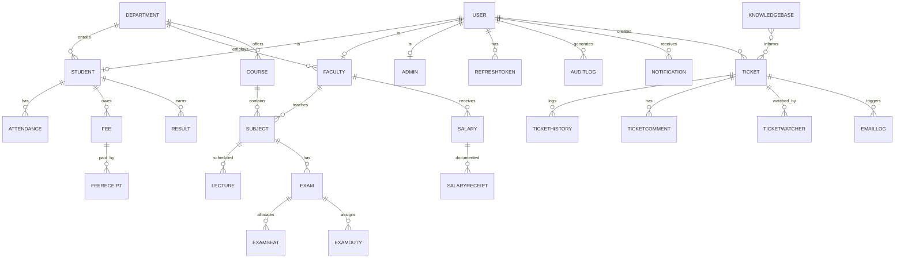

# Entity-Relationship Diagram

The full, authoritative schema is in [`../prisma/schema.prisma`](../prisma/schema.prisma) (25+ models).

## Core Tables
Users, Students, Faculty, Admins, Departments, Courses, Subjects, Lectures, Timetables,
Attendance, Fees, FeeReceipts, Salaries, SalaryReceipts, Exams, ExamSeat, ExamDuty, Results,
Notes, Events, Meetings, AcademicCalendar, Tickets, TicketHistory, TicketComment, TicketWatcher,
Notifications, EmailLogs, KnowledgeBase, AuditLogs, RefreshToken.
